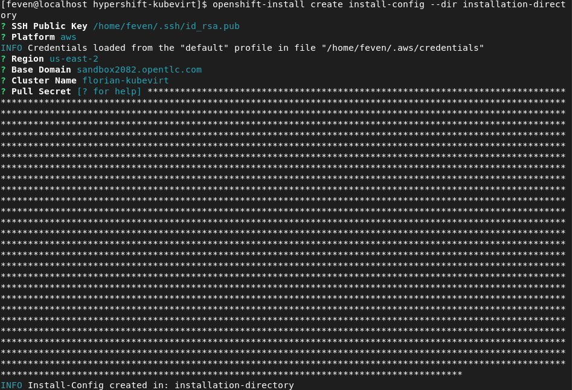
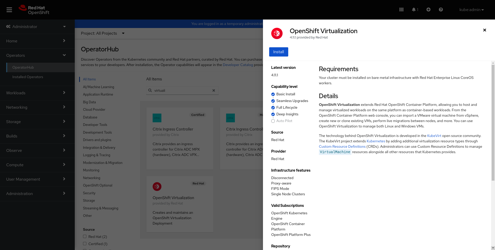
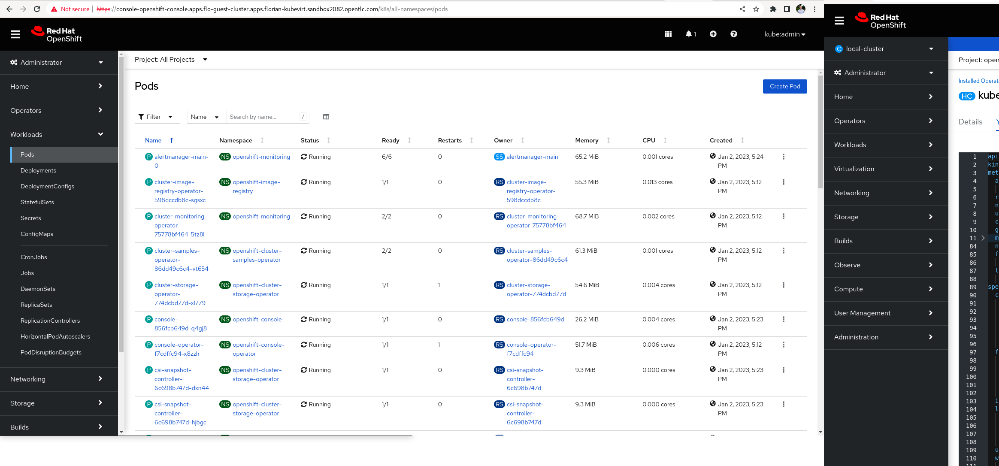

###

Ce guide utilise un environnement AWS. Celui-ci peut etre obtenu via RHPDS>Open Environment>AWS Blank Open Environment>Order

###
On commence par creer un cluster openshift avec des noeuds baremetal (Openshift Virtualization ne peux pas etre utilise sur des VM hosts).

Parametrer votre configuration aws.

```shell
aws configure
```

On creer ensuite le fichier d'installation Openshift.

```shell
openshift-install create install-config --dir installation-directory
```

Completez les parametre relatif a votre cluster.



Dans ce guide on utilisera des instances types m5.metal. Aller dans installation-directory et modifier le fichier install-config.yaml pour utiliser des worker baremetals.

```shell
compute:
- architecture: amd64
  hyperthreading: Enabled
  name: worker
  platform:
    aws:
      type: m5.metal
  replicas: 2
```

Copier le fichier de config puis lancer l'installation.

```shell
cp install-config.yaml install-config/install-config.yaml
openshift-install create cluster --dir installation-directory
```

### Installation Openshift Virtualization et le multicluster-engine 

#### Openshift Virtualization 


Cliquez sur Opérateurs → OperatorHub.

Selectionnez OpenShift Virtualization.

Lisez les informations sur l'opérateur et cliquez sur Installer.

Creez ensuite une instance d'OpenShift Virtualization Deployment.



#### Mutlicluster engine

A noter que MCE ne peut pas coexister avec une version ACM antérieure à 2.5 car il y a des composants qui se chevauchent.

Cliquez sur Opérateurs → OperatorHub.

Selectionnez MutliCluster Engine.

Lisez les informations sur l'opérateur et cliquez sur Installer.

Creez ensuite une instance de mutlicluster engine.
```shell
oc apply -f - <<EOF
apiVersion: multicluster.openshift.io/v1
kind: MultiClusterEngine
metadata:
  name: multiclusterengine
spec: {}
EOF
```

### Configuration d'hypershift

Installer le binaire hypershift puis active le mode hypershift preview du MCE.On patch egalement l'ingress controller pour pouvoir utiliser un sous-domaine de *apps.

```shell
oc patch ingresscontroller -n openshift-ingress-operator default --type=json -p '[{ "op": "add", "path": "/spec/routeAdmission", "value": {wildcardPolicy: "WildcardsAllowed"}}]'
```

```shell
oc patch mce multiclusterengine --type=merge -p '{"spec":{"overrides":{"components":[{"name":"hypershift-preview","enabled": true}]}}}' 
```

Créer le ManagedCluster local-cluster qui permet aux composants MCE de traiter le cluster sur lequel il s'exécute comme un hôte pour les clusters invités.

```shell
oc apply -f - <<EOF
apiVersion: cluster.open-cluster-management.io/v1
kind: ManagedCluster
metadata:
  labels:
    local-cluster: "true"
  name: local-cluster
spec:
  hubAcceptsClient: true
  leaseDurationSeconds: 60
EOF
```

Enfin on ajoute l'addon hypershift

```shell
oc apply -f - <<EOF
apiVersion: addon.open-cluster-management.io/v1alpha1
kind: ManagedClusterAddOn
metadata:
  name: hypershift-addon
  namespace: local-cluster
spec:
  installNamespace: open-cluster-management-agent-addon
EOF
```

### Creation du hosted cluster


On configure les variables d'environement

```shell
export KUBEVIRT_CLUSTER_NAME=flo-guest-cluster
export KUBEVIRT_CLUSTER_NAMESPACE="clusters-${KUBEVIRT_CLUSTER_NAME}"
export BASE_DOMAIN=$(oc get ingresscontroller -n openshift-ingress-operator default -o yaml | grep domain | awk '{print $2}')
export KUBEVIRT_CLUSTER_BASE_DOMAIN=${KUBEVIRT_CLUSTER_NAME}.${BASE_DOMAIN}
export PULL_SECRET="/path/to/pull-secret"
```

```shell
hypershift create cluster \
kubevirt \
--name $KUBEVIRT_CLUSTER_NAME \
--base-domain $BASE_DOMAIN \
--node-pool-replicas=2 \
--memory '6Gi' \
--pull-secret $PULL_SECRET \
--release-image=quay.io/openshift-release-dev/ocp-release@sha256:b33682f203818fcec713c1c7cbe0b01731c8b64991579ca95d1a6409823c652a
```

On attend ensuite que les vms passe au status Ready

```shell
oc get vms -n $KUBEVIRT_CLUSTER_NAMESPACE
```

On peut ensuite generer le kubeconfig du guest cluster

```shell
hypershift create kubeconfig --name="$KUBEVIRT_CLUSTER_NAME" > "${KUBEVIRT_CLUSTER_NAME}-kubeconfig"
```

On peut ensuite suivre la creation des cluster-operator avec: 

```shell
oc --kubeconfig ${KUBEVIRT_CLUSTER_NAME}-kubeconfig get clusteroperators -A
```

Creation de l'ingress service:

```shell
export HTTPS_NODEPORT=$(oc --kubeconfig "${KUBEVIRT_CLUSTER_NAME}-kubeconfig" get services -n openshift-ingress router-nodeport-default -o wide | awk '{print $5}' | awk -F "443:" '{print $2}' | awk -F "/" '{print $1}' | tr -d '[:space:]')
```
```shell
oc create -f - <<EOF
apiVersion: v1
kind: Service
metadata:
  labels:
    app: ${KUBEVIRT_CLUSTER_NAME}
  name: apps-ingress
  namespace: ${KUBEVIRT_CLUSTER_NAMESPACE}
spec:
  internalTrafficPolicy: Cluster
  ipFamilies:
  - IPv4
  ipFamilyPolicy: SingleStack
  ports:
  - name: https-443
    port: 443
    protocol: TCP
    targetPort: $HTTPS_NODEPORT
  selector:
    kubevirt.io: virt-launcher
  sessionAffinity: None
  type: ClusterIP
EOF
```

Create ingress route

```shell
oc create -f - <<EOF
apiVersion: route.openshift.io/v1
kind: Route
metadata:
  name: ${KUBEVIRT_CLUSTER_NAME}-443
  namespace: ${KUBEVIRT_CLUSTER_NAMESPACE}
spec:
  host: data.apps.$KUBEVIRT_CLUSTER_BASE_DOMAIN
  wildcardPolicy: Subdomain
  tls:
    termination: passthrough
  port:
    targetPort: https-443
  to:
    kind: Service
    name: apps-ingress
    weight: 100
EOF
```
Lorsque la console est up and running on peux y acceder via l'url suivante
```shell
echo console-openshift-console.apps.${KUBEVIRT_CLUSTER_NAME}.${BASE_DOMAIN}
```

Le kubeadmin-password peut etre obtenu avec la commande suivante:

```shell
oc get secret  -n $KUBEVIRT_CLUSTER_NAMESPACE kubeadmin-password -o go-template --template="{{.data.password|base64decode}}"
```


